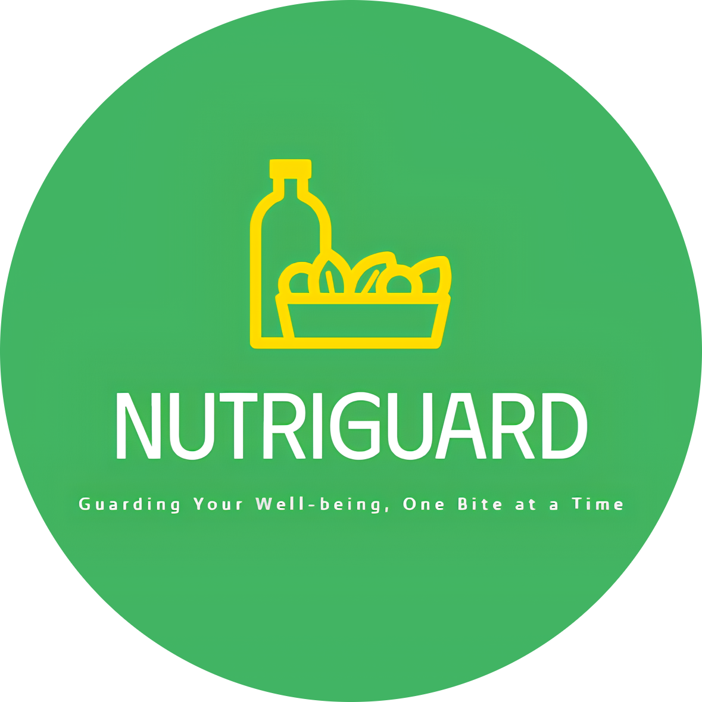

## 
NutriGuard

  

#### 
Guarding Your Well-Being, One Bite at Time

This project aims to fulfill the requirements of the <strong><a href="https://grow.google/intl/id_id/bangkit/?tab=machine-learning">Bangkit Academy led by Google, Tokopedia, Gojek, & Traveloka</a></strong>.

    <a href="https://example.com">Project Plan</a> &middot;
    <a href="https://drive.google.com/file/d/1lV2Yl1h0pj63MZvE62RV2WBLuhlicLU6/view?usp=sharing">Project Brief</a> &middot;
    <a href="https://example.com](https://www.canva.com/design/DAGYnLpdC4o/s8vpCo4-mFged6tLuGE4cg/edit">Presentation Slide</a> &middot;
    <a href="https://example.com">Business Market Proposal</a> 

© C242-PR647 Bangkit 2024 Capstone Team

 

#### 
 <a href="https://example.com"> Visit Now!</a> 

 

## Table of Content

- [About NutriGuard](#about-nutriguard)
- [Background](#background)
- [Repositories Documentation](#repositories-documentation)
  - [Machine Learning Development Documentation](#machine-learning-development-documentation)
  - [Cloud Computing Development Documentation](#cloud-computing-development-documentation)
  - [Front-end Web Development Documentation](#front-end-web-development-documentation)
  - [Dataset](#dataset)
- [Team Member](#team-member)

## About NutriGuard

**NutriGuard** is an AI-powered web application designed to revolutionize healthy eating by providing personalized food and meal recommendations based on user preferences and dietary needs. The app considers a wide range of variables, including cooking time, calorie requirements, health conditions (e.g., diabetes-friendly), flavor preferences, meal types (e.g., snacks, desserts), and halal compliance.

By leveraging advanced machine learning, NutriGuard simplifies the process of choosing meals by offering tailored ingredient and meal suggestions that save time, support balanced diets, and meet specific health goals. It addresses underserved dietary needs, such as halal compliance and culturally relevant food options, empowering users to make informed food choices with ease.

The project employs the K-Prototypes algorithm for food clustering and deep learning models to predict new clusters, ensuring precise and dynamic recommendations. A user-friendly interface enables users to input preferences and receive personalized suggestions seamlessly. NutriGuard combines cutting-edge technology with nutritional science to promote inclusivity, convenience, and healthier lifestyles for a diverse global audience.

## Background

blablabla

## Repositories Documentation

- #### Machine Learning Development Documentation : [ML Branch](https://github.com/NutriGuard/ml)
- #### Cloud Computing Development Documentation : [CC Branch](https://github.com/NutriGuard/cc)
- #### Front-end Web Development Documentation : [WEB FE Branch](https://github.com/NutriGuard/web-fe)
- #### Dataset : [Indonesian Food and Drink Nutrition Dataset](https://docs.google.com/spreadsheets/d/1ckybW4EpxQYZVbMQkAwzNxdvdCg9IvjF/edit?gid=441525641#gid=441525641)

## Team Member

| Bangkit ID   | Name                  | Learning Path      | University             |
| ------------ | --------------------- | ------------------ | ---------------------- |
| A010D4KY4498 | Muhammad Farrel Sirah | Cloud Computing    | Universitas Mulawarman |
| M010B4KY4188 | Sobirin Nur Imam      | Machine Learning   | Universitas Indonesia  |
